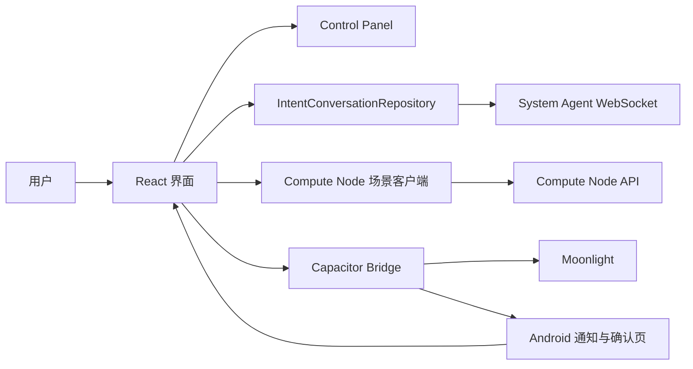

# IntentLink 软件设计

## 1. 设计目标

IntentLink 用一条可演示的用户旅程说明网络能力如何响应自然语言意图。应用负责收集意图、展示系统代理的澄清结果、确认计算资源，并在 Android 上把用户交给 Moonlight。它不是网络编排器，真正的意图理解和场景切换由外部服务完成。

Web 与 Android 共用 React 代码。Android 工程通过 Capacitor 承载 Web 界面，只把通知、后台定时任务和外部应用启动等平台能力放在原生层。

## 2. 运行时结构

`App.tsx` 负责跨体验编排，具体界面拆分到独立 React 组件。WebSocket、主机配置、Compute Node 请求和 Moonlight 包检测分别放在独立模块中，避免把传输细节写进界面组件。

## 3. Direct Intent

### Experience 意图

Control Panel 保存 System Agent 主机后，应用连接 `ws://<host>:7201/api/ws`。`IntentConversationRepository` 保存消息、连接状态和 `session_id`，`IntentWebSocketDataSource` 负责连接、心跳和指数退避重连。

首次请求发送 `session_id: 0`。服务返回 `CLARIFY` 时，回复显示为澄清问题；用户的下一条消息继续使用服务返回的会话编号。返回 `DONE` 时，界面展示确认文本和 `final_data`。没有配置后端时，应用改用本地演示结果。

### Compute 意图

游戏意图不会立即跳转。应用先在对话中显示 Compute Available Card，用户点击 `Deduct & Launch` 后才执行以下步骤：

1. 调用 `POST http://<host>:7878/scenarios/overload/arm`。
2. 请求成功后检查已安装的 Moonlight 包，优先选择 `com.limelight.debug`。
3. 申请通知权限、安排延迟告警并打开 Moonlight。
4. 用户在告警中点击 `Fix` 后返回 IntentLink，应用调用 base 场景接口并继续升级动画。

场景请求失败时不会打开 Moonlight，错误会回到 Direct Intent 对话，方便现场排查。

## 4. 状态与配置

当前体验、网络等级、对话消息和升级进度保存在 React 内存状态中。System Agent 与 Compute Node 主机保存到 `localStorage`。远端 `session_id` 只在当前应用进程内复用；新会话操作会清空消息上下文并将它重置为 `0`。

Android 原生层通过 `DemoFlowPlugin` 暴露通知权限、延迟告警和待处理升级动作。`MainActivity` 使用 `singleTask`，因此用户从通知返回时会回到同一个应用任务。

## 5. 接口与失败处理

System Agent 使用 `send_turn`、`turn_result`、`error`、`ping` 和 `pong` 帧。连接断开后保留消息与会话编号，发送中的一帧可以在重连后补发。服务端错误显示为对话消息。

Compute Node 应返回形如 `{"ok":true,"activeScenario":"overload"}` 的 JSON。应用同时检查 HTTP 状态、`ok` 和实际场景。Moonlight 未安装、通知权限被拒绝或 Android 调用失败时，流程会保留在 IntentLink 并给出明确提示。

当前演示使用局域网明文 HTTP 与 WebSocket，没有认证、证书校验或敏感数据持久化。公网部署前需要改用 TLS，并补充设备身份、请求授权和日志脱敏。

## 6. 验证策略

Vitest 覆盖消息解析、会话复用、重连、错误帧、Compute Node URL 和 Moonlight 包选择。Playwright 覆盖统一界面、移动端 Control Panel、Direct Intent 交互和场景失败路径。Android APK 还需要在真机上验证应用跳转、后台通知以及从通知返回后的 base 场景切换。
